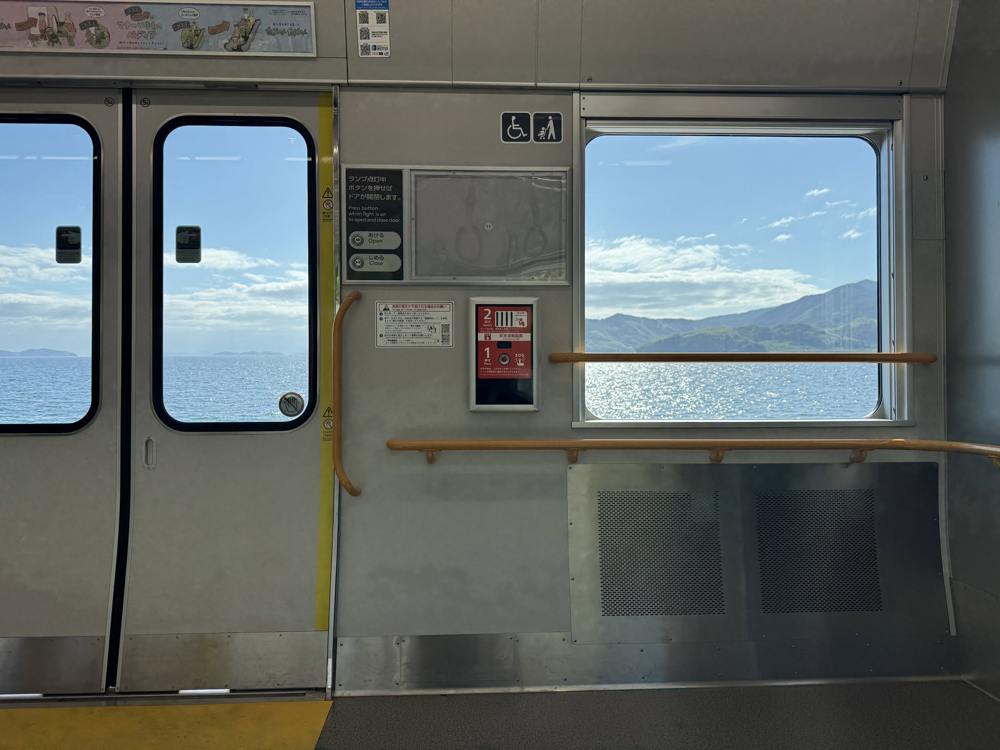

+++
date = '2026-09-26T21:03:24+09:00'
draft = false
title = 'The best way to see Japan'
+++

Japan is a unique country with a deep culture. Often when exploring Japan, the standard travel experience is to visit Tokyo, Osaka, Kyoto, and sometimes another stop on the Shinkansen. While all are great cities with incredible cultural significance, much is missed when simply visiting the highlights. Sometimes to have a more complete experience, you must take the long route and stop at less visited locations.

## Finding extraordinary in the mundane

Growing up, I would often look out the window on long road trips thinking about what it would be like to stop at seemingly mundane places. Maybe a small town with under one hundred residents and no real points of interest, maybe a resturaunt with no menu items of note, maybe just a small park with no real significance. When visiting these places, however, I found that the culture and history of the location often has so much more to offer than first meets the eye. 

Recently when riding Japan's bullet train, the Shinkansen, I find myself again looking out and wanting to stop and investigate a small town, resturaunt, or park. Sadly, the train only stops a few times at large cities until reaching the destination and I am left wondering what may be out there in the places between stops.

## The stations between

To satisfy my curiousity, I decided to start taking the long route and visit the stations less visited. Taking local trains allows one to stop whenever and experience a more complete Japan, even though it may require a considerably longer travel time. By doing so, I have learned about local cultures, made friends, and enjoyed local cuisine in a way I wouldn't be able to if I had stayed on the path most visited.

In the coming months, I will share short posts about the adventures to be had by stopping at the stations between.

